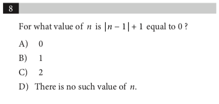

<notice>教程读者请不要直接阅读本文件，因为诸多功能在此无法正常使用，请移步至[程谱 coderecipe.cn](https://coderecipe.cn/learn/10)学习完整教程。如果您喜欢我们的教程，请在右上角给我们一个“Star”，谢谢您的支持！</notice>

前言
====
在学习之前
----
SAT数学共有两个Section，第一个Section不能使用计算器，考试时间为25分钟，共20道题，其中15道单选题，5道填空题。

第二个Section允许使用计算器，考试时间为55分钟，共38道题，其中30道单选题，8道填空题。

SAT数学分为两种大类的题型：

1. 知识点类：这类型的题目考察简单的知识点的掌握，只要熟悉知识点，就可以比较轻松的做出这种类型的题目

2. 应用题类：这类型的题目以应用题的形式出现，虽然还是考察了基本知识点，但是将其放在具体情境的context中进行应用，通常的表现是很多的介绍文字，要想做出这种题目除了需要对知识点的熟练掌握之外，还需要有一定的阅读能力，去除掉题干中的无关信息，找到解题的真正的关键点。

—对于750+，想要冲刺800分的学生，可能是因为粗心，也有可能是因为某一个或几个知识点有盲区，需要进行查漏补缺。

—对于没有上700分的同学，知识点本身一定存在着巨大的漏洞，很有可能对一些知识点根本没有概念，需要这些知识点从头开始的学习和认知。

因此，Peer Insight 三位数学满分，SAT 1550+ 的导师通过分析整理15+套SAT数学真题，总结出了15个大类知识点。无先后顺序，按照自己的情况可以来学习对应的知识点，不管是查漏补缺还是从头学习都更有针对性和系统性。
